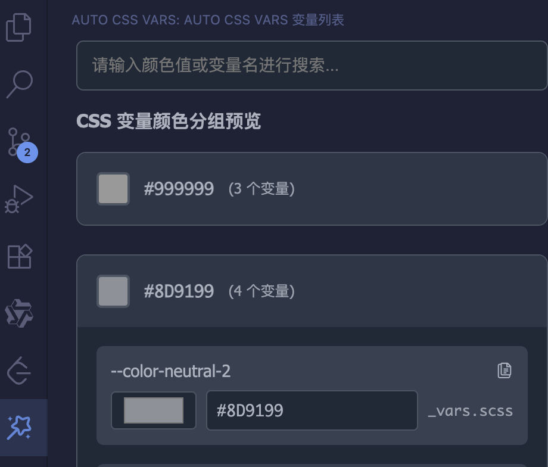

# color-vars-plugin README

一个 css 变量插件，可以将写入的颜色值，转为项目中的 css 变量。

## 如何使用

### 1. 需要在项目的根目录中新增 `.autocolorvars.cjs` 或 `.autocolorvars.js` 文件，写入css变量的路径

```js
module.exports = {
  cssFiles: ['src/assets/style/_vars.scss', 'src/assets/style/_vant.scss']
}
```

### 2. 展示

在活动侧边栏中，有个窗口会展示出所有css变量（相同颜色值的为一组），可以进行颜色搜索


