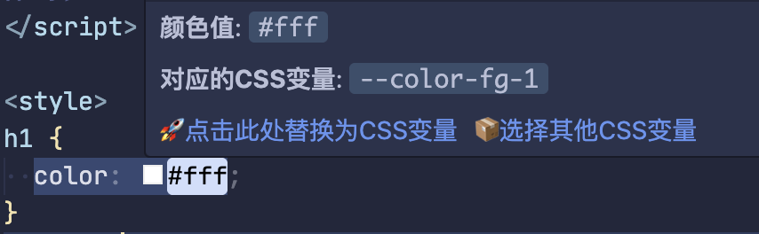
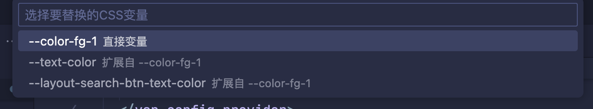
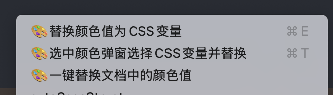

# color-vars-plugin README

一个 css 变量插件，可以将写入的颜色值，转为项目中的 css 变量。

## 如何使用

### 1. 需要在项目的根目录中新增 `.autocolorvars.cjs` 或 `.autocolorvars.js` 文件，写入 css 变量的路径

```js
module.exports = {
  cssFiles: ['src/assets/style/_vars.scss', 'src/assets/style/_vant.scss']
}
```

### 2. 功能

1. 在活动侧边栏中，有个窗口会展示出所有 css 变量（相同颜色值的为一组），可以进行颜色搜索


2. 鼠标悬浮在变量上，会显示变量的详细描述，点击对应的按钮可以进行颜色替换



双击选中变量，点击按钮进行颜色替换，选择其他颜色则会打开命令面板快速切换 CSS 变量名进行选择



3. 快捷键操作

替换颜色快捷键：`ctrl+e/command+e`
进入变量选择面板：`ctrl+t/command+t`

4. 右键选中替换


